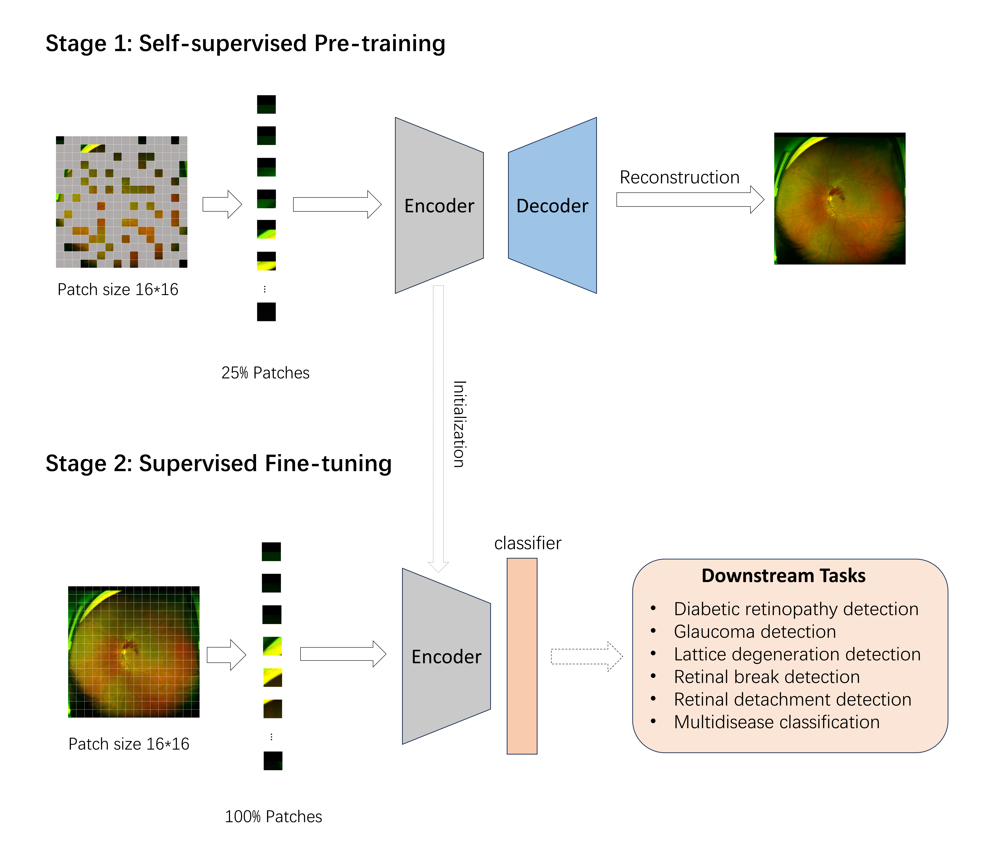
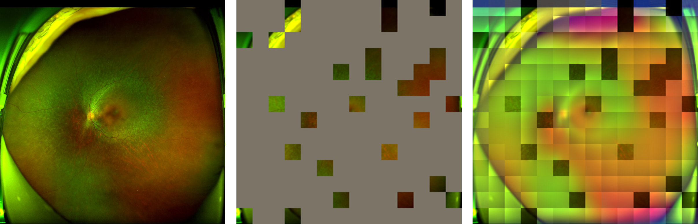

# **USPEC - A Large Domain-Optimized Pretrained Model Enhancing Performance in UWF-Based Ophthalmic Tasks.**


<p align="center">
  
</p>

## Introduction

This repository contains the source code for developing the large UWF-specific pretrained model (USPEC) and for finetuning the USPEC-enhanced model. The USPEC is pre-trained on 875,947 unlabeled UWF images from 5 independent clinical centers using Masked Autoencoders([MAE](https://github.com/facebookresearch/mae)), and it has demonstrated efficacy across multiple UWF-based ophthalmic tasks. For the original pretraining code of Masked Autoencoders, please refer to [MAE](https://github.com/facebookresearch/mae).


## Prerequisities & Installation

Create environment with conda
```bash
conda create -n uspec python==3.8
conda activate uspec
```

Install dependencies for pretraining and finetuning
```bash
pip install torch==1.11.0+cu113 torchvision==0.12.0+cu113 torchaudio==0.11.0 --extra-index-url https://download.pytorch.org/whl/cu113
git clone https://github.com/NBeye-research/USPEC.git
cd USPEC
pip install -r requirements.txt
```
* The pretraining code is based on [`timm==0.3.2`](https://github.com/rwightman/pytorch-image-models), for which a [fix](https://github.com/rwightman/pytorch-image-models/issues/420#issuecomment-776459842) is needed to work with PyTorch 1.8.1+.

Install dependencies for explaninability
```bash
pip install matplotlib opencv-python einops timm==0.4.5
```


## Developing USPEC

Organise your data into this directory structure
```bash
├──img_root_path
    ├──file1
        ├──image1
        ├──image2
        ├──...
    ├──file2
        ├──...
    ├──file3
        ├──...
```

To pre-train ViT-Large with **multi-node distributed training**, run the following on 6 nodes with 6 GPUs each:
```bash
IMAGENET_DIR=/path/to/img_root_path/
OUTPUT_DIR=/path/to/outputs/
LOG_DIR=${OUTPUT_DIR}logs

#model pretrain
CUDA_VISIBLE_DEVICES=0,1,2,3,4,5 python -m torch.distributed.launch --nproc_per_node=6 --master_port=48000 main_pretrain.py \
    --batch_size 256 \
    --model mae_vit_large_patch16_cross_attention \
    --output_dir ${OUTPUT_DIR} \
    --log_dir LOG_DIR \
    --mask_ratio 0.75 \
    --norm_pix_loss \
    --epochs 800 \
    --warmup_epochs 40 \
    --blr 1.5e-4 \
    --weight_decay 0.05 \
    --data_path ${IMAGENET_DIR}
``` 
- Here the effective batch size is 256 (`batch_size` per gpu) * 6 (gpus) = 1536.
- Training time is ~230h in 6 A40 GPUs (800 epochs).


## Fine-tuning USPEC for Classification
To fine tune USPEC on your own data, follow these steps:
### step 1: Download the USPEC Pre-Trained weights
USPEC  [Google Drive](https://drive.google.com/file/d/1vs4BdPP6PMWsP0_b7HQWbw7CB2qHiy9P/view?usp=sharing)


### step2: Organise your data into this directory structure
```bash
├──train
    ├──class_a
    ├──class_b
    ├──class_c
├──val
    ├──class_a
    ├──class_b
    ├──class_c
├──test
    ├──class_a
    ├──class_b
    ├──class_c
``` 
## step3: Run finetuning

Only use the encoder of the USPEC and discard the decoder.
```bash

DATA_PATH=/path/to/dataset_dir
OUTPUT_DIR=/path/to/otputs
FINETUNE=/path/to/USPEC.pt
#Number of labels
NUM_LABEL=8

CUDA_VISIBLE_DEVICES=0,1,2,3,4,5,6,7 python -m torch.distributed.launch --nproc_per_node=8 --master_port=48000 main_finetune.py \
    --batch_size 16 \
    --model RETFound_mae \
    --savemodel \
    --batch_size 16 \
    --epochs 100 \
    --blr 5e-3 --layer_decay 0.65 \
    --weight_decay 0.05 --drop_path 0.2 \
    --nb_classes ${NUM_LABEL} \
    --data_path ${DATA_PATH} \
    --input_size 224 \
    --finetune ${FINETUNE} \
    --output_dir ./finetune_models \
    --task USPEC \
    --global_pool

```


## Run few-shot finetuning

```bash

DATA_PATH=/path/to/data_dir
FINETUNE_PATH=/path/to/finetuned_model.pt
#Number of shot
FEW_SHOT=1
#Number of labels
NUM_LABEL=2

CUDA_VISIBLE_DEVICES=0,1 python -m torch.distributed.launch --nproc_per_node=2 main_few_shot_finetuning.py \
    --batch_size 16 \
    --model RETFound_mae \
    --savemodel \
    --batch_size 16 \
    --epochs 50 \
    --blr 1e-3 --layer_decay 0.65 \
    --weight_decay 0.05 --drop_path 0.2 \
    --nb_classes ${NUM_LABEL} \
    --data_path ${DATA_PATH} \
    --input_size 224 \
    --finetune ${FINETUNE_PATH} \
    --output_dir ./few_shot_models \
    --task ori_vit \
    --global_pool \
    --seed 1 \
    --few_shot ${FEW_SHOT}

```

## Visualization demo

Run the USPEC visualization demo using [USPEC_visualize.ipynb](./USPEC_visualize.ipynb), which is based on [MAE](https://github.com/facebookresearch/mae):
<p align="center">
  
</p>

Run the USPEC-enhanced finetuned model heatmap demo using [Finetuned_model_explaninability.ipynb](./Finetuned_model_explaninability.ipynb) , which is based on [Transformer-Explainability](https://github.com/hila-chefer/Transformer-Explainability):
<p align="center">
  
</p>


**Please feel free to contact us for any questions or comments: Zhongwen Li, E-mail: li.zhw@qq.com or Yangyang Wang, E-mail: youngwang666@hotmail.com.**
